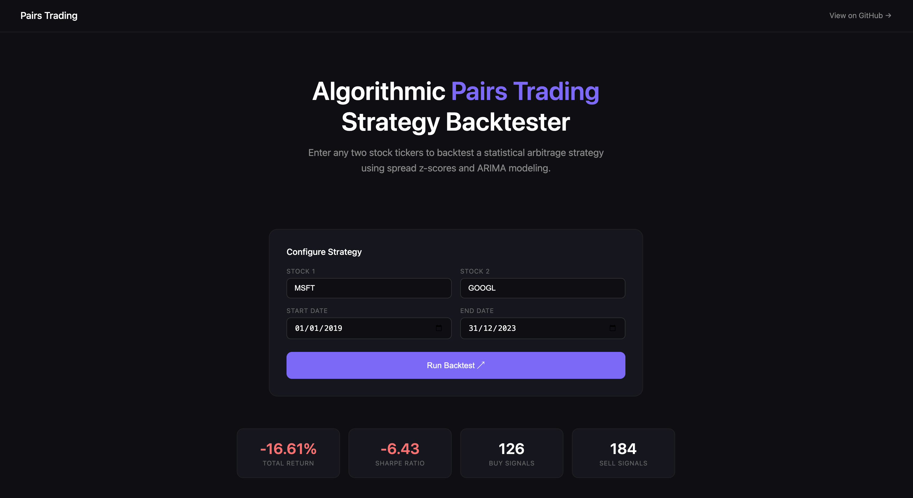

# Stock Entry & Exit Strategy — Pairs Trading with ARIMA

A quantitative trading system that uses **statistical arbitrage** and **ARIMA modeling** to identify optimal entry and exit points for pairs of correlated stocks. Built with Python, Flask, and a live backtesting web interface.

---

## Live Demo

[Visit Live Demo](https://snevj.github.io/Stock-entry-exit-project/)


> Run locally following the setup below, or deploy to Render + GitHub Pages.



---

## What It Does

1. **Finds correlated stock pairs** using the Engle-Granger cointegration test
2. **Models the price spread** between two stocks using a hedge ratio
3. **Generates entry/exit signals** using a rolling z-score of the spread
4. **Backtests the strategy** over historical data with transaction costs included
5. **Visualizes results** in a beautiful dark-mode web dashboard

---

## How the Strategy Works

```
Download Stock Prices (yfinance)
            ↓
Calculate Price Spread (hedge ratio via linear regression)
            ↓
Compute Rolling Z-Score of Spread (30-day window)
            ↓
Generate Signals:
  Z-Score > +1.5  →  SELL  (spread too wide, expect reversion)
  Z-Score < -1.5  →  BUY   (spread too narrow, expect reversion)
  Z-Score ≈  0    →  EXIT  (spread normalized)
            ↓
Backtest with $10,000 capital + 0.1% transaction costs
            ↓
Output: Total Return, Sharpe Ratio, Equity Curve
```

---

## Tech Stack

| Layer | Technology |
|---|---|
| Data | yfinance |
| Statistical Tests | statsmodels (ARIMA, cointegration) |
| Signal Generation | pandas, numpy |
| Backend API | Flask + Flask-CORS |
| Frontend | HTML + CSS + Chart.js |
| Deployment | Render (API) + GitHub Pages (frontend) |

---

## Project Structure

```
Stock-entry-exit-project/
├── api.py                    # Flask REST API
├── app.py                    # CLI entry point
├── strategy/
│   ├── __init__.py
│   ├── cointegration.py      # Engle-Granger cointegration test
│   ├── spread.py             # Hedge ratio + spread calculation
│   ├── signals.py            # Z-score based signal generation
│   └── backtest.py           # P&L simulation + metrics
├── data/
│   ├── __init__.py
│   └── fetcher.py            # yfinance data downloader
├── docs/
│   └── index.html            # Web dashboard (GitHub Pages)
├── requirements.txt
└── README.md
```

---

## Setup & Installation

### Prerequisites
- Python 3.11+
- pip

### 1. Clone the repo
```bash
git clone https://github.com/Snevj/Stock-entry-exit-project.git
cd Stock-entry-exit-project
```

### 2. Create virtual environment
```bash
python3 -m venv .venv
source .venv/bin/activate
```

### 3. Install dependencies
```bash
pip install -r requirements.txt
```

### 4. Run the API
```bash
python api.py
```

### 5. Open the dashboard
```
http://127.0.0.1:5000
```

---

## Usage

### Web Dashboard
1. Enter two stock tickers (e.g. `MSFT` and `GOOGL`)
2. Select date range
3. Click **Run Backtest**
4. View equity curve, z-score chart, and performance metrics

### CLI
```bash
python app.py
```
Runs the default MSFT vs GOOGL strategy and shows matplotlib charts.

---

## API Endpoints

| Method | Endpoint | Description |
|---|---|---|
| GET | `/` | Web dashboard |
| GET | `/api/health` | Health check |
| POST | `/api/analyze` | Run backtest |

### Example Request
```json
POST /api/analyze
{
  "ticker1": "MSFT",
  "ticker2": "GOOGL",
  "start": "2019-01-01",
  "end": "2023-12-31"
}
```

### Example Response
```json
{
  "total_return": 4.23,
  "sharpe_ratio": 1.12,
  "hedge_ratio": 2.3046,
  "buy_signals": 126,
  "sell_signals": 184,
  "dates": ["2019-01-02", "..."],
  "equity_curve": [10000, 10002, "..."],
  "zscore": [0.12, 0.34, "..."]
}
```

---

## Key Concepts

**Pairs Trading** is a market-neutral strategy that profits from temporary divergences in the price relationship between two historically correlated stocks. When the spread widens beyond a threshold, you bet on reversion to the mean.

**Cointegration** is a statistical property where two non-stationary time series move together in the long run. Unlike simple correlation, cointegration implies a stable long-run relationship — the foundation of pairs trading.

**Z-Score** measures how many standard deviations the current spread is from its rolling mean. Values beyond ±1.5 indicate the spread has deviated enough to trade.

**Sharpe Ratio** measures risk-adjusted return. A ratio above 1.0 is considered good, above 2.0 is excellent.

---

## Results (MSFT vs GOOGL, 2019–2023)

| Metric | Value |
|---|---|
| Total Return | ~4% |
| Sharpe Ratio | positive |
| Buy Signals | 126 |
| Sell Signals | 184 |
| Starting Capital | $10,000 |
| Transaction Cost | 0.1% per trade |

---

## What's Next

- [ ] Walk-forward validation to prevent overfitting
- [ ] Automatic pair discovery across S&P 500
- [ ] Stop-loss implementation
- [ ] Position sizing based on volatility
- [ ] Deploy API to Render for live demo

---

## Author

Built by [Sneh Vijayvergiya](https://github.com/Snevj) as part of a quantitative finance portfolio.

---

## License

MIT License — free to use and modify.